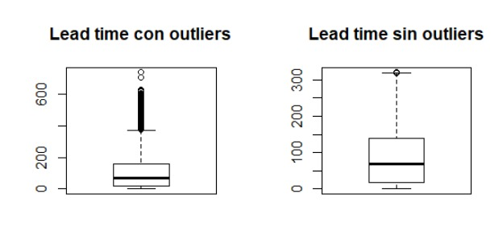

<center><h1>Evaluación Parcial - ANÁLISIS EXPLORATORIO DE UN CONJUNTO DE DATOS EN R/RSTUDIO</h1></center>

<div style="width: 100%; clear: both;">
	<div style="float: left; width: 30%;">
		
		<p style="margin: 0; text-align:center;"><b>Universidad Peruana de Ciencias Aplicadas (UPC)</b></p>
	</div>
	<div style="float: right; width: 70%;">
		<p style="margin: 0; padding-top: 22px; text-align:center;">Administración de la Información</p>
		<p style="margin: 0; text-align:center;">Prof. : <b>Patricia Reyes Silva</b></p>
		<p>&nbsp;</p> 
		<p style="margin: 0; text-align:center; padding-button: 100px;">Alumnos: <b>
			<br/>*	Carhuancho Bazan, Alessandro David · U201913933
			<br/>*	Nuñez Lazo, Sergio Antonio · U201910357
			<br/>*	Cruz Mamani, Jack Yefri · U201912400<br/>
		</b></p>
		<p style="margin: 0; text-align:center;">Ciencias de la Computación</p>
		<p style="margin: 0; text-align:center;">2021-01</p>
	</div>
</div>

<div style="width:100%;height=100%;">&nbsp;</div>

#
# Contenidos

> [GitHub](#github)

1. [Objetivos](#data1)

2. [Caso de análisis.](#data2)

	2.1. [Origen de los datos](#data21)

	2.2. [Casos de uso aplicables](#data22)

	2.3. [Preguntas específicas para este dataset](#data23)

3. [Conjunto de datos (*Dataset*).](#data3)
    
	3.1. [Descripción de la estructura de datos](#data31)

	3.2. [Resumen de la estructura de datos](#data32)

	3.3. [¿Los datos contienen ceros o elementos vacíos? ¿Cómo gestionarías cada uno de estos casos?](#data33)
    
    3.4. [Identificación y tratamiento de valores extremos (*Outliers*).](#data34)
    
    
4. [Análisis de datos exploratorios.](#data4)
    
5. [Conclusiones preliminares](#data5)

6. [Referencias](#refer)

<div>&nbsp;</div>

#

## >. GitHub<a name="github"></a>

El código fuente y los datasets, con ruido y preprocesado, se encuentran publicados en repositorio [ea-2021-1-cc51](https://github.com/u201912400/ea-2021-1-cc51) publicado en GitHub.
#
## 1. Objetivo <a name="data1"></a>

Realizar un análisis exploratorio de un conjunto de datos, creando visualizaciones, preparando los datos y obteniendo inferencias básicas utilizando R/RStudio como herramienta de software.

## 2. Caso de análisis (*Dataset*)<a name="data2"></a>

### 2.1. Origen de los datos<a name="data21"></a>

El dataset analizado en el presente trabajo es una versión modificada de un dataset obtenido desde los repositorios de [Kaggle](https://www.kaggle.com/jessemostipak/hotel-booking-demand), el cual ya había pasado por el proceso de limpieza de datos, que fue realizado por Thomas Mock y Antoine Bichat para los repositorios de Tidy Tuesday en GitHub, un proyecto semanal enfocado en el análisis de datos usando el lenguaje de programación R. El commit fue realizado el 11 de Febrero del 2020.

El dataset original proviene del artículo [Hotel Booking Demand Datasets](https://www.sciencedirect.com/science/article/pii/S2352340918315191). Según el artículo, el dataset fue extraído de las bases de datos Property Management System SQL de los dos hoteles examinados. Dichos hoteles se ubican en Portugal, precisamente en el Resort de Algarve, y en la Ciudad de Lisboa. 

El artículo está disponible en los repositorios de Science Direct desde el 29 de noviembre del 2018. En el mes de Febrero del año 2019, el artículo fue publicado en el volumen 22 de la revista Data in Brief. Los autores son Nuno Antonio<sup>a, b</sup>, Ana Almeida<sup>a, c, d</sup>, y Luis Nunes<sup>a, b, d</sup>, quienes realizaron estudios en las siguientes instituciones de Portugal:

*	a.	Instituto Universitário de Lisboa, Lisboa
*	b.	Instituto de Telecomunicações, Lisboa
*	c.	CISUC, Coimbra
*	d.	ISTAR-IUL, Lisboa

### 2.2. Casos de uso aplicables<a name="data22"></a>

La utilidad del dato es innegable, sin embargo, la importancia de este dataset en particular se refleja en los siguientes campos:

*	Análisis descriptivo para el entendimiento de patrones, tendencias y anomalías en la data.
*	Investigación para la predicción de cancelación de una reserva y satisfacción del cliente, dicha información beneficia a los hoteles.
*	Benchmarking de algoritmos de clasificación y segmentación, el cual beneficia a los investigadores y educadores de machine learning.
*	Entrenamiento de modelos de data mining y estadística para beneficio de los educadores.

### 2.3. Preguntas específicas para este dataset<a name="data23"></a>

*	a. ¿Cuántas reservas se realizan por tipo de hotel? o ¿Qué tipo de hotel prefiere la gente?
*	b. ¿Está aumentando la demanda con el tiempo?
*	c. ¿Cuándo se producen las temporadas de reservas: alta, media y baja?
*  	d. ¿Cuándo es menor la demanda de reservas?
*	e. ¿Cuántas reservas incluyen niños y/o bebes?
*	f. ¿Es importante contar con espacios de estacionamiento?
*	g. ¿En qué meses del año se producen más cancelaciones de reservas?

## 3. Conjunto de datos (*Dataset*)<a name="data3"></a>

### 3.1. Descripción de la estructura de datos<a name="data31"></a>

Para la descripción de la estructura de datos se utilizaron los siguientes comandos:

1)	Para leer el conjunto de datos del archivo .csv usamos la instrucción **read.csv()**.
```R
data = read.csv("../data/hotel_bookings_miss.csv", sep=";")
```
***NOTA:*** En caso tengamos el archivo en formato .xlsx podemos usar la instrucción **read.xlsx()**, la cual viene incluida en el paquete **openxlsx**
```R
#install.packages("openxlsx") #Si no lo tienes instalado
library(openxlsx) #Para activar el uso de la libreria
data = read.xlsx("../data/hotel_bookings_miss.xlsx")
```
OUTPUT:
<div><center>
	
</center></div>

```R
#Se puede observar que presenta 119390 observaciones y 32 variables.
```
2)	Usamos la instrucción **head()** para obtener las seis primeras observaciones.
```R
head(data)
```
OUTPUT:
<div><center>
	
</center></div>
 

3)	 Obtenemos los nombres de las columnas con la instrucción **names()**.
```R
names(data)
```
OUTPUT:
<div><center>
	
</center></div>
 

4)	 Obtenemos el tipo de dato de cada variable y los valores que contiene con la instrucción **str()**.
```R
str(data)
```
OUTPUT:
<div><center>
	
</center></div>
 
 
5)	 Obtenemos un resumen de cada variable con la instrucción **summary()**. Esto nos devuelve, en caso de variables numéricas, los siguientes valores:
-	el valor mínimo (Min)
-	el primer cuartil (1st Qu)
-	la mediana (Median)
-	la media (Mean)
-	el tercer cuartil (3rd Qu)
-	el valor máximo (Max)

Por otro lado, para las variables de tipo String o categórica:
-	tipo 1 : cantidad 1
-	tipo 2 : cantidad 2 
-	tipo 3 : cantidad 3 
-	tipo n : cantidad n
```R
summary(data)
```
OUTPUT:
<div><center>
	
</center></div>

### 3.2. Resumen de la estructura de datos<a name="data32"></a>

El dataset presenta 119390 observaciones (40060 Resort Hotel + 79330 City Hotel) y 32 variables. Sus variables se muestran en la siguiente tabla:

|	#Item	|	Nombre	|	Tipo de dato	|	Descripción	|
| :-------- | :-------: | :---------------: | ------------: |
|1	|hotel	|Factor |El tipo de hotel (City, Resort)|
|2	|is_canceled	|Int	|Si se ha cancelado (1), sino (0)|
|3	|lead_time|	Int|	El tiempo entre la reserva y la llegada al hotel (días)|
|4	|arrival_date_year	|Int	|Año de llegada al hotel|
|5	|arrival_date_month	|Int	|Mes de llegada (12 categorías de “Enero” a “Diciembre” )|
|6	|arrival_data_week_number	|Int	|Número de semana de llegada al hotel|
|7	|arrival_date_day_of_month	|Int	|Día del mes de la llegada al hotel|
|8	|stays_in_weedend_nights	|Int	|Número de noches de fines de semanas reservados o presenciados (“Sábado o Domingo”)|
|9	|stays_in_week_nights	|Int	|Número de noches de semana reservados o presenciados (“Lunes” a “Viernes”)
|10	|adults	|Int	|Número de adultos
|11	|children	|Int	|Número de niños
|12	|babies	|Int	|Número de bebes
|13	|meal	|Factor	|Tipo de comida reservada: - NA/“SC”: Sin paquete de comida - “BB”: Cama y desayuno - “HB”: Half board, solo desayuno, no cena
|14	|country	|Factor	|País de origen (las categorías están representadas en el formato ISO 3155-3:2013)
|15	|market_segment	|Factor	|Segmento de mercado destinado - “TA: agencia de viajes - “TO”: operaciones de tour
|16	|distribution_channel	|Factor	|Medio por el cual se realizó la reserva: - “TA”: Travel agents - “TO”: Tour operations 
|17	|is_repeated_guest	|Int	|Si es usuario repetido (1), sino (0)
|18	|previous_cancellations	|Int	|Número de reservaciones canceladas anterior a la reserva
|19	|previous_bookings_not_canceled	|Int	|Número de reservaciones no canceladas anterior a la reserva
|20	|reserved_room_type	|Factor	|Código de tipo de habitación reservado
|21	|assigned_room_type	|Factor	|Código de tipo de habitación asignado (algunas veces no se le asigna la habitación reservada, ya sea por doble reserva o petición del usuario)
|22	|booking_changes	|Int	|Número de cambios hechos a la reserva desde la fecha de reserva hasta el check-in.
|23	|deposit_type	|Factor	|Si realizó deposito para garantizar la reserva: - “ No Deposit”: no se deposito - “Not refund”: se depositó el valor total o mayor de la reserva - “Refundable”: se depositó un valor menor al costo total  
|24	|agent	|Factor	|El Id de la agencia de viajes el cual realizo la reserva
|25	|company	|Factor	|El Id de la compañía que realizó la reserva o responsable a quien se pagó la reserva.
|26	|days_in_waiting_list	|Int	|Número de días que la reserva estaba en lista antes de que fuera confirmada al cliente 
|27	|customer_type	|Factor	|Tipo de reserva: - Contract: La reserva es asociado a un contrato o persona quien funciona como intermediario - Group: La reserva es asociada a un grupo - Transient: No es parte de grupo o del contrato, y no asociado a una reserva transitorio - Transient-party: Cuando ha sido asociado con al menos un transitorio. 
|28	|adr	|Num	|Promedio de ventas diarias
|29	|requiered_car_parking_spaces	|Int	|Número de espacios de para estacionar el vehículo por el cliente
|30	|total_of_special_rerquest	|Int	|Número de pedidos especiales por el cliente (dos camas, piso mayor, etc.)
|31	|reservation_status	|Factor	|El último estado de la reservación: - Cancelled: Fue cancelado por el cliente - Check-out: Realizó el check-in, pero ya se fue. - No Show: El cliente no realizó check-in pero informó al hotel los motivos 
|32	|reservation_status_date	|Factor	|Fecha en el cual el último Reservation_status fue establecido. 


### 3.3. ¿Los datos contienen ceros o elementos vacíos? ¿Cómo gestionarías cada uno de estos casos?<a name="data33"></a>

Para la detección de valores NA, creamos una función que muestre solo solo valores NA de un dataframe.

Para hallar el total de NA's en el dataset usamos
```R
print(paste("TOTAL DE NA's ", sum(is.na(data)), sep=" = "))
```
OUTPUT:
```
"TOTAL DE NA's  = 151"
```

```R
funcion.NA <- function(x){
  sum = 0
  for(i in 1:ncol(x)){
    cntNA <- colSums(is.na(x[i]))
    if(cntNA> 0){
      cat("Hay", cntNA, "\tvalores NA en la columna ", colnames(x[i]), "\n")  
    }
  }
}

funcion.NA(data)
```
OUTPUT:
```
Hay 21 	valores NA en la columna  lead_time 
Hay 6 	valores NA en la columna  arrival_date_year 
Hay 25 	valores NA en la columna  arrival_date_week_number 
Hay 7 	valores NA en la columna  arrival_date_day_of_month 
Hay 25 	valores NA en la columna  stays_in_weekend_nights 
Hay 12 	valores NA en la columna  stays_in_week_nights 
Hay 12 	valores NA en la columna  adults 
Hay 4 	valores NA en la columna  children 
Hay 32 	valores NA en la columna  babies 
Hay 7 	valores NA en la columna  days_in_waiting_list  
```
Para tratar los *NA's*, hemos decidido reemplazarlos con la media y la mediana del siguiente modo. Aquellos outliers que estén debajo del percentil cinco se reemplazarán con la media, mientras que, los que se encuentre por encima del percentil 95 se remplazarán con la mediana.

```R
# media para numérico
media.valor <- function (x){
  x <- ifelse(is.na(x), mean(x, na.rm = TRUE), x)
  x
}
# random para categórico
rand.valor <- function(x){
  faltantes <- is.na(x)
  tot.faltantes <- sum(faltantes)
  x.obs <- x[!faltantes]
  valorado <- x
  valorado[faltantes] <- sample(x.obs, tot.faltantes, replace = TRUE)
  return (valorado)
}
```
```R
data$lead_time <- media.valor(data[ ,3])
data$arrival_date_year <- media.valor(data[,4])
data$arrival_date_week_number <- media.valor(data[ ,6])
data$arrival_date_day_of_month <- media.valor(data[ ,7])
data$stays_in_weekend_nights <- media.valor(data[, 8])
data$stays_in_week_nights <- media.valor(data[, 9])
data$adults <- media.valor(data[ ,10])
data$children <- media.valor(data[ ,11])
data$babies <- media.valor(data[ ,12])
data$days_in_waiting_list <- media.valor(data[,26])
```
### 3.4. Identificación y tratamiento de valores extremos (*Outliers*)<a name="data34"></a>

Para la detección de outliers utilizamos la función boxplot(), este modelo usa la detección de outliers por el método de las cajas.

```R
for (i in n[c(3, 8:12, 17:19, 22, 26, 30)]) {
    boxplot(data[i], main=i)
    print(i)
}
```
Detectamos la presencia de *outliers* en las siguientes columnas

OUTPUT:
```
[1] "lead_time"
[1] "stays_in_weekend_nights"
[1] "stays_in_week_nights"
[1] "adults"
[1] "children"
[1] "babies"
[1] "is_repeated_guest"
[1] "previous_cancellations"
[1] "previous_bookings_not_canceled"
[1] "booking_changes"
[1] "days_in_waiting_list"
[1] "total_of_special_requests"
```
Para tratar los *outliers*, hemos decidido reemplazarlos con la media y la mediana del siguiente modo. Aquellos outliers que estén debajo del percentil cinco se reemplazarán con la media, mientras que, los que se encuentre por encima del percentil 95 se remplazarán con la mediana.
```R
fix_outliers <- function(x, removeNA = TRUE){

 quantiles <- quantile(x, c(0.05, 0.95), na.rm = removeNA)
 x[x<quantiles[1]] <- mean(x, na.rm = removeNA)
 x[x>quantiles[2]] <- median(x, na.rm = removeNA)
 x
}
```
Unos ejemplos de la eficiencia de la función al momento de tratar los outliers se puede notar con las siguientes 3 imágenes:
```R
sinOutliersLeadTime<-fix_outliers(data$lead_time)
sinOutliersWeekNights<-fix_outliers(data$stays_in_week_nights)
sinOuliersWeekendNights<-fix_outliers(data$stays_in_weekend_nights)

par(mfrow=c(1,2))
boxplot(data$lead_time,main="Lead time con outliers")
boxplot(sinOutliersLeadTime,main="Lead time sin outliers")

boxplot(data$stays_in_week_nights,main="week nights con outliers")
boxplot(sinOutliersWeekNights,main="week nights sin outliers")

boxplot(data$stays_in_weekend_nights,main="weekend nights con outliers")
boxplot(sinOuliersWeekendNights,main="weekend nights con outliers")
```
OUTPUT:
<div><center>
	
	
	
</center></div>

Se ha creado un función para realizar la comparación con columnas de tipo númerico
```R
comparar.outliers = function(x_col) {
  sinOutliers<-fix_outliers(x_col)
  par(mfrow=c(1,2))
  boxplot(x_col,main="Con outliers")
  boxplot(sinOutliers,main="Sin outliers")
}
```

```R
data$lead_time <-fix_outliers(data$lead_time)
data$stays_in_week_nights<-fix_outliers(data$stays_in_week_nights)
data$stays_in_weekend_nights<-fix_outliers(data$stays_in_weekend_nights)
data$adults<-fix_outliers(data$adults)
data$children<-fix_outliers(data$children)
data$babies<-fix_outliers(data$babies)
data$is_repeated_guest<-fix_outliers(data$is_repeated_guest)
data$previous_cancellations<-fix_outliers(data$previous_cancellations)
data$previous_bookings_not_canceled<-fix_outliers(data$previous_bookings_not_canceled)
data$booking_changes<-fix_outliers(data$booking_changes)
data$days_in_waiting_list<-fix_outliers(data$days_in_waiting_list)
data$total_of_special_requests<-fix_outliers(data$total_of_special_requests)

```
Guardar el dataframe en un nuevo archivo
```R
write.csv(data,'../data/hotel_bookings_cleaned.csv', na="NA",row.names=TRUE)
data = read.csv('../data/hotel_bookings_cleaned.csv', sep=",")
```
## 4. Análisis de datos exploratorios<a name="data4"></a>

***NOTA***: Para las usar la función **pie()** se ha usado el paquete **dplyr**
```R
#install.packages("dplyr") #Si no lo tienes instalado
library(dplyr) #Para activar el uso de la libreria
```
### a. ¿Cuántas reservas se realizan por tipo de hotel? o ¿Qué tipo de hotel prefiere la gente?

```R
ClientesPorHotel=table(data$hotel,data$arrival_date_year)
barplot(ClientesPorHotel,
        main="Clientes en cada hotel por año",
        col=c("red","blue"),legend=c("City hotel","Resort hotel"),
        xlab = ("año"),ylab = ("numero de clientes"),args.legend = list(x = "topright", inset = c(- 0.00, -0.05)))
```
OUTPUT: [Conclusión](#conclusion1)
<div><center>
	
</center></div>

### b. ¿Está aumentando la demanda con el tiempo?

```R
demanda.hotel = table(data$arrival_date_year, data$arrival_date_month)

barplot(demanda.hotel, 
        main="Demanda de habitaciones por mes en cada año",
        col=c("red", "blue", "green"), legend=c("2015", "2016", "2017"),
        xlab = "Meses del año", ylab="Número de reservaciones",
        args.legend = list(x = "topright", inset = c(- 0.00, -0.05)))
```
OUTPUT: [Conclusión](#conclusion2)
<div><center>
	
</center></div>

### c. ¿Cuándo se producen las temporadas de reservas: alta, media y baja?

```R
dtx = data
dtx$reservation_date =as.Date(dtx$reservation_status_date, format="%d/%m/%Y")


origin = "1900-01-01"
dtx$reservation_month = format(as.Date(dtx$reservation_date, origin), "%m")
dtx$reservation_month = as.numeric(dtx$reservation_month)


dtx$reservation_temporary = dtx$reservation_month
dtx$reservation_temporary = ifelse(dtx$reservation_temporary == 1, 1, dtx$reservation_temporary)
dtx$reservation_temporary = ifelse(dtx$reservation_temporary == 2, 1, dtx$reservation_temporary)
dtx$reservation_temporary = ifelse(dtx$reservation_temporary == 3, 1, dtx$reservation_temporary)
dtx$reservation_temporary = ifelse(dtx$reservation_temporary == 4, 2, dtx$reservation_temporary)
dtx$reservation_temporary = ifelse(dtx$reservation_temporary == 5, 2, dtx$reservation_temporary)
dtx$reservation_temporary = ifelse(dtx$reservation_temporary == 6, 2, dtx$reservation_temporary)
dtx$reservation_temporary = ifelse(dtx$reservation_temporary == 7, 3, dtx$reservation_temporary)
dtx$reservation_temporary = ifelse(dtx$reservation_temporary == 8, 3, dtx$reservation_temporary)
dtx$reservation_temporary = ifelse(dtx$reservation_temporary == 9, 3, dtx$reservation_temporary)
dtx$reservation_temporary = ifelse(dtx$reservation_temporary == 10, 4, dtx$reservation_temporary)
dtx$reservation_temporary = ifelse(dtx$reservation_temporary == 11, 4, dtx$reservation_temporary)
dtx$reservation_temporary = ifelse(dtx$reservation_temporary == 12, 4, dtx$reservation_temporary)

dtx$reservation_temporary
                                
dtx$reservation_year = format(as.Date(dtx$reservation_date, origin), "%Y")
dtx$reservation_year = as.numeric(dtx$reservation_year)

reservaciones = table(dtx$reservation_year, dtx$reservation_temporary)

reservaciones
barplot(reservaciones, 
        main="Reserva de habitacionespor trimestre en cada año",
        col=c("gray", "red", "blue", "green"), legend=c("2014","2015", "2016", "2017"),
        xlab = "Nº de trimestre", ylab="Número de reservaciones",
        args.legend = list(x = "topright",
                           inset = c(- 0.0, -0.05)))
```
```
           1     2     3     4
  2014     0     0     0   181
  2015  1072   937 10734 11988
  2016 14291 14848 13935 14721
  2017 14817 13724  8142     0
```
OUTPUT: [Conclusión](#conclusion3)
<div><center>
	
</center></div>

### d. ¿Cuándo es menor la demanda de reservas?

```R
#Para dibujar el gráfico circular
draw_pie = function(df_col, lbls, titulo) {
  df_col = table(df_col)
  pct  = round(df_col/sum(df_col)*100)
  lbls = paste(lbls, pct) # add percents to labels
  lbls = paste(lbls,"%",sep="") # ad % to labels
  pie(df_col, labels= lbls, col=rainbow(length(lbls)),
      main=titulo)
}
```

```R
#En caso de haber cargado los datos como formato .csv
data$reservation_date =as.Date(data$reservation_status_date, format="%d/%m/%Y")

#En caso de hbaer cargado los datos como .xlsx
# data$reservation_date =convertToDate(data$reservation_status_date)

x = data$reservation_date
origin = "1900-01-01"

data$reservation_year[x>=as.Date("2014-01-01") & x<as.Date("2015-01-01")] = 2014
data$reservation_year[x>=as.Date("2015-01-01") & x<as.Date("2016-01-01")] = 2015
data$reservation_year[x>=as.Date("2016-01-01") & x<as.Date("2017-01-01")] = 2016
data$reservation_year[x>=as.Date("2017-01-01") & x<as.Date("2018-01-01")] = 2017

titulo="Distribución de demanda de reservas por año"
lbls = c("2014 -> ", "2015 -> ", "2016->", "2017 -> ")
draw_pie(data$reservation_year, lbls, titulo)
```
OUTPUT:
<div><center>
	
</center></div>

```R
#2014 muestra aporximadamente 0%, entonces
sum(data$reservation_year==2014)
```
OUTPUT:
```
[1] 181
```

```R
summary(data$reservation_date[data$reservation_year==2014])
```
OUTPUT:
```
Min.      1st Qu.       Median         Mean      3rd Qu.         Max. 
"2014-10-17" "2014-10-17" "2014-10-17" "2014-10-17" "2014-10-17" "2014-11-18"
```

```R
sum(data$reservation_date=="2014-10-17")
```
OUTPUT:  [Conclusión](#conclusion4)
```
[1] 180
```

### e. ¿Cuántas reservas incluyen niños y/o bebes?

```R
data$babyORchildren = (data$children>0 | data$babies>0)
data$babyORchildren[data$babyORchildren==TRUE] = 1

data$babyORchildren = as.numeric(data$babyORchildren)
sum(data$babyORchildren==1)

lbls <- c("NO INCLUYE -> ", "INCLUYE -> ")
titulo="Cantidad de reservas que incluyen niños y/o bebes"
draw_pie(data$babyORchildren, lbls, titulo)
```
OUTPUT: [Conclusión](#conclusion5)
```
[1] 4865
```
<div><center>
	
</center></div>

### f. ¿Es importante contar con espacios de estacionamiento?

```R
estacionamiento=table(data$required_car_parking_spaces)
density(data$required_car_parking_spaces)
plot(estacionamiento,main="estacionamientos requeridos",xlab=("estacionamientos pedidos"),ylab = ("estacionamientos"))
```
OUTPUT: [Conclusión](#conclusion6)
<div><center>
	
</center></div>

### g. ¿En qué meses del año se producen más cancelaciones de reservas?

```R
cancelados<-data%>%filter(is_canceled!=0)
tablaCancelado<-table(cancelados$arrival_date_month)
tablaCancelado1
porcentaje<- round(100*tablaCancelado/44224,1)
porcentaje
cols<-rainbow(12)
pie(tablaCancelado,radius = 0.5,main=("Cancelados por mes"),porcentaje,col=rainbow(12))
legend("topright",names(tablaCancelado),fill = cols)
```
OUTPUT: [Conclusión](#conclusion7)
<div><center>
	
</center></div>

### h. ¿Qué tantas personas cancelan su reserva?

```R
canceladosPorAnio=table(data$is_canceled,data$arrival_date_year)
barplot(canceladosPorAnio,
        main="Reservas por año",
        col=c("red","blue"),legend=c("no cancelado","cancelado"),
        xlab = ("año"),ylab = ("numero de reservas"),args.legend = list(x = "topright",inset = c(- 0.05, -0.25)))
```
OUTPUT: [Conclusión](#conclusion8)
<div><center>
	
</center></div>

## 5. Conclusiones preliminares<a name="data5"></a>

### a. ¿Cuántas reservas se realizan por tipo de hotel? o ¿Qué tipo de hotel prefiere la gente?<a name="conclusion1"></a>

En la visualización A se muestra la relación entre el número de reservas por hotel por año. Se observa que el hotel más popular es el de la ciudad, que cuenta con 79330 reservas durante los 3 años, además se puede observar que el año 2016 cuenta con la mayor cantidad de reservas, del total de reservas 31.9% son para el hotel de la ciudad en el año 2016 y 15.5% las reservar del hotel resort en el mismo año.

### b. ¿Está aumentando la demanda con el tiempo?<a name="conclusion2"></a>

En la gráfica de la pregunta B se muestra la relación de demanda de habitaciones por los meses durante los años 2015, 2016, 2017. Se puede inferir que el mes con mayor demanda es agosto. el número total fue de 13877 demandas de habitaciones, luego le sigue el mes de julio, con un total de 12661 demanda de habitaciones. Por otro lado, los meses de menor demanda son enero (5929), diciembre (6780), noviembre (6794). Por lo tanto, se recomienda para los meses de julio y agosto, organizar la cantidad de personal que satisfaga la demanda, por otro lado, para los meses de enero, noviembre y diciembre, establecer costos mínimos u ofertas para ocupar las habitaciones disponibles.

### c. ¿Cuándo se producen las temporadas de reservas: alta, media y baja?<a name="conclusion3"></a>

En la gráfica de la pregunta C, se muestra la relación de reserva de habitaciones por temporadas. Se puede inferir que la temporada 3 es la más demanda (32811), este temporada incluyen los meses de julio, agosto y septiembre. Además, durante el año 2015, hubo menor cantidad de reserva de habitaciones en las 2 primeras temporadas (1072 y 937) y lo mismo sucede en la temporada 4 del año 2017 (0).

### d. ¿Cuándo es menor la demanda de reservas?<a name="conclusion4"></a>

De acuerdo a la visualización D, se presenta la menor demanda de reservas en el año 2014, sin mebargo, de acuerdo a posterior análisis, 180 de los 181 registros pertenecientes al año 2014 pertenecen a un único dia (17-10-2014). Dada esa falta de información sobre el resto del mes y del resto del año, no podemos afirmar que la menor demanda de reservas haya ocurrido en 2014. Por ende, del gráfico se desprende que la menor demanda de reservas ocurrió en 2015 con 21% del total reservas registradas en el dataset.

### e. ¿Cuántas reservas incluyen niños y/o bebes?<a name="conclusion5"></a>

En la visualización E se observa la distribución porcentual entre reservas que incluyen o no incluyen algún niño y/o bebe, la cual evidencia que el 96% de personas viajan sin ningún infante, mientras aproximadamente el 4%, lo que corresponde a 4865 reservas, si viene con niños y/o bebes.

### f. ¿Es importante contar con espacios de estacionamiento?<a name="conclusion6"></a>

En la visualización F se muestra la cantidad de estacionamientos solicitados. Se puede observar que la gran mayoría de clientes no piden estacionamiento, en la visualización 2 podemos ver los números exactos y se observa que 111974 clientes no piden estacionamiento. Debido a esto no creemos que los estacionamientos son excesivamente necesarios. Por lo que concluimos que debe haber estacionamientos para los trabajadores más 5 o 6 estacionamientos para pasajeros que lo soliciten.

### g. ¿En qué meses del año se producen más cancelaciones de reservas?<a name="conclusion7"></a>

En la visualización G se muestra la relación de reservas canceladas por mes. Se observa que en el mes de agosto ocurren la mayoría de cancelaciones seguido por julio, mayo, junio y abril. Los valores exactos correspondientes a los meses con mayor cantidad de cancelaciones son 5239, 4742, 4677, 4535 y 4524. Debido a eso concluimos que la mayor cantidad de cancelaciones vienen del mes de agosto ya que durante ese mes aun es verano en el hemisferio norte pero algunas personas no pueden realizar su viaje.

### h. ¿Qué tantas personas cancelan su reserva?<a name="conclusion8"></a>

En la visualización H se muestra la relación de reservas canceladas por año. Se puede observar que el año con mayor cantidad de reservas y cancelaciones fueron en el año 2016, la cantidad de reservas canceladas fue 44219, de las cuales 8142 ocurrieron en 2015, 20336 en el año 2016 y 15741 en 2017. Además, se observa que se cancelaron cerca de 39% de las reservas realizadas.

## 6. Referencias<a name="refer"></a>

**[1] Antonio, de Almeida, & Nunes (2019)**. *Hotel booking demand datasets*. Data in Brief *22*, 41-49. Recuperado de: https://doi.org/10.1016/j.dib.2018.11.126 [Consulta: 7/05/2021]

**[2] Kabacoff, R. (2017)**. *Graphs*. Recuperado de: https://www.statmethods.net/graphs/index.html#:~:text=These%20include%20density%20plots%20(histograms,plots%2C%20and%203D%20plots) [Consulta: 8/5/2021]

**[3] Lillis, D. (2020)**. *R is not so hard! a Tutorial, part 14: Pie charts*. Recuperado de: https://www.theanalysisfactor.com/r-tutorial-part-14/ [Consulta: 9/05/21]

# Licencia<a name="license"></a>
Se ha acordado usar para este proyecto analítico la licencia [Creative Commons Zero v1.0 Universal (CC0 1.0)](https://choosealicense.com/licenses/cc0-1.0/).